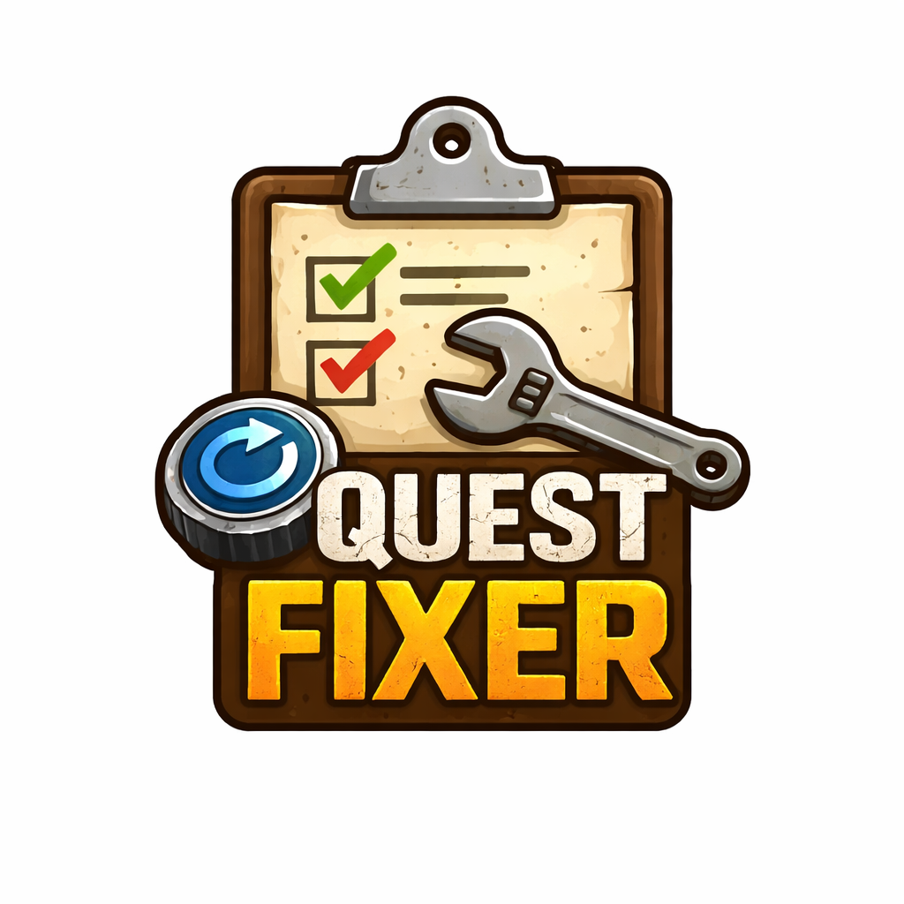

# Quest Fixer - Mod for Escape from Duckov

A mod for fixing broken quests in Escape from Duckov game.



## Features

- **Quest Tree Visualization** - View quest dependencies and prerequisites organized by NPC
- **Quest Completion** - Mark any quest as completed by ID
- **Quest Activation** - Reset and reactivate quests for replay
- **Quest Search** - Search quests by name or ID
- **Quest Status** - View runtime status of all quests (Completed/In Progress/Not Started)
- **Quest Details** - Detailed information about quest requirements, tasks, and blockers
- **Force Activate** - Bypass quest requirements for bugged quests
- **API Inspector** - View game's Quest API for modding purposes

## Controls

- **F8** - Open/close mod menu (in-game only)

## Installation

### Option 1: Manual Installation

1. Download/compile the mod
2. Copy the `QuestFixer` folder to:
   - **Windows**: `<game path>/Duckov_Data/Mods/`
   - **Mac**: `Duckov/Duckov.app/Contents/Mods/`
3. Launch the game and activate the mod in Mods menu

### Option 2: Steam Workshop

Subscribe to the mod in Steam Workshop (if published).

## Building from Source

### Requirements

- **.NET SDK 6.0+** or **Visual Studio 2019+**
- **Escape from Duckov** installed
- **UnityExplorer** (optional, for runtime debugging)
- **BepInEx** (optional, for advanced modding)

### Quick Build Command

From the project root directory:

```bash
dotnet build -c Release
```

The DLL will be automatically copied to the game's Mods folder if `DuckovPath` is set correctly in `QuestFixer.csproj`.

**Note:** Update the destination path to match your game installation path.

### Detailed Build Steps

1. Open `QuestFixer.csproj` in your editor
2. Update the `<DuckovPath>` property to your game installation path:
   ```xml
   <DuckovPath>C:\Program Files (x86)\Steam\steamapps\common\Escape from Duckov</DuckovPath>
   ```
3. Build the project:
   ```bash
   dotnet build -c Release
   ```
4. The DLL will be automatically copied to the mods folder (if path is correct)

### Development Tools

For local development and debugging, you may want to install:

- **UnityExplorer** - Runtime Unity inspector and C# console
  - Useful for inspecting game objects, scenes, and executing C# code at runtime
  - Download from: [UnityExplorer Releases](https://github.com/sinai-dev/UnityExplorer/releases)
  - Install as a BepInEx plugin

- **BepInEx** - Modding framework for Unity games
  - Required for UnityExplorer
  - Download from: [BepInEx Releases](https://github.com/BepInEx/BepInEx/releases)
  - Install to game directory

**Note:** UnityExplorer and BepInEx are optional and only needed for advanced debugging. The mod works without them.

## File Structure

```
duckov_mov/
├── Logics/             # Game logic helpers
├── Models/             # Data models
├── UI/                 # User interface
├── ModBehaviour.cs     # Main entry point
├── QuestFixer.csproj   # Project file
├── QuestFixer.sln      # Solution file
├── info.ini            # Mod configuration
└── README.md           # This file
```

## Usage

### Opening the mod

Press F8 while in-game (not in main menu) to open the mod window. Press F8 again to close it.

### Quests tab

This shows a list of all quests in the game.

At the top there's an input field where you can enter a quest ID and press:
- **Complete** — finishes all quest tasks
- **Activate** — activates or restarts the quest

Below that is a Filter field — type quest name or ID to search.

Each quest in the list shows its status:
- [v] green — completed
- [*] blue — in progress  
- [ ] gray — not started

Every quest row has Complete and Activate buttons on the right.

### Tree tab

Shows quests organized by NPC quest givers with dependency chains.

Buttons at the top:
- **Build** — analyzes quests and builds the dependency tree (click this first)
- **By NPC / Search** — switch between grouped view and chain search
- **Expand / Collapse** — expand or collapse all nodes

In By NPC mode:
- Click on NPC name to expand/collapse their quests
- Click on a quest to show/hide quests that unlock after it
- The **?** button opens detailed quest info

In Search mode:
- Enter quest ID in the field
- Click **Chain** to see what quests are required before it and what it unlocks

The **?** button shows:
- Quest description and tasks
- Requirements (level, location, items)
- Why the quest might be blocked
- **Force Activate** button to bypass requirements (use carefully, may break progression)

### Advanced features (usually not needed)

The **API Quest** and **Log** tabs, as well as **Service Functions** button (top right corner) are hidden service features for troubleshooting. Most users will never need them. They contain technical info for mod developers and manual system refresh options in case something doesn't load properly

## Notes

- The mod uses reflection to access the game's quest system
- Quest changes are saved to your save file
- Use with caution - resetting story quests may break progression
- The mod only works in-game (not in main menu)

## Known Issues

- Some quests may not appear until a save is loaded
- If quest system is not found, try reloading the save
- Quest statuses update automatically when you open the Quests tab

## Compatibility

- Escape from Duckov (current version)
- .NET Standard 2.1
- Harmony 2.4.1 (optional)

## License

Free to use and modify.

## Credits

- [duckov_modding](https://github.com/xvrsl/duckov_modding) - Official modding guide
- [DuckovCheatMenu](https://github.com/MoDz420/DuckovCheatMenu) - Special thanks to the creator! I learned mod structure, window management, and other implementation approaches by studying this mod. 
